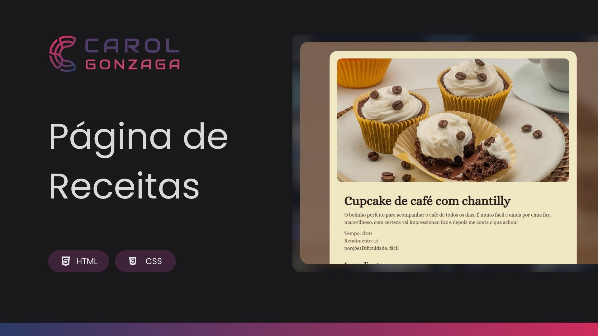

  

 

Projeto de uma página de receita apresentando um delicioso cupcake de café com chantilly.

  <a href="#-tecnologias">Tecnologia</a>&nbsp;&nbsp;&nbsp;|&nbsp;&nbsp;&nbsp;<a href="https://carolgonzaga.github.io/pagina-de-receita/">Acesse o Projeto</a>

 
 

  

 
 

## 🚀 Tecnologias

Esse projeto foi desenvolvido com as seguintes tecnologias:

- HTML5
- CSS3

 
 

## 🎯 Objetivo

O objetivo desse projeto é consolidar conhecimentos fundamentais sobre estruturação de páginas com HTML e estilização com CSS. A página exibe uma receita culinária, garantindo uma experiência visual agradável e organizada. Durante o desenvolvimento, foram exploradas técnicas de espaçamento, fontes, imagens e ajustes de layout para criar um design limpo e harmonioso.
